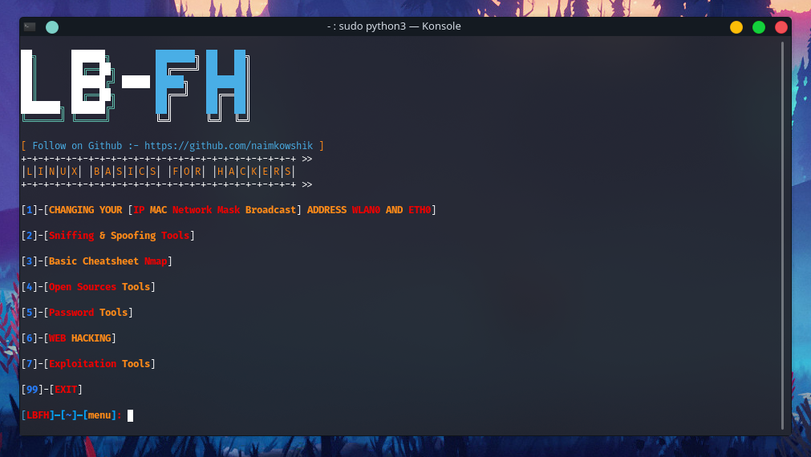

<p align="center">
  
</p>
<div align="center"> 
  <a href="https://github.com/naimkowshik/LBFH">
    
  </a>
  <a href="https://www.python.org/">
    
  </a>
  <a href="https://twitter.com/K0WSHIK">
    
  </a>
  <a href="https://www.jetbrains.com/pycharm/download/#section=windows">
    
  </a>
</div>
<br />

**ONLY DOWNLOAD IT HERE, DO NOT TRUST OTHER PLACES.**

Written by: [ **TeamKurais** ]-[ **Twitter** ] [@K0WSHIK](https://twitter.com/K0WSHIK), [ **GitHub** ] [@naimkowshik](https://github.com/naimkowshik)

## 🔖 About

We have created this tool that many new people come in the world of pen testing & Ethical Hacking. They do not know much about the basics. So this tool has been created to help them. I hope you share this tool with your new friends.

[ **DISCLAIMER** ] **:** This is only for testing purposes and can only be used where strict consent has been given. Do not use this for illegal purposes, period.

# 📃 Features
#### [ Menu ] :
* Changing Your [ IP Mac Network Mask Broadcast ] Address Wlan0 And Eth0
* Sniffing & Spoofing Tools
* Basic Cheatsheet Nmap
* Open Sources Tools
* Password Tools
* Web Hacking
* Exploitation Tools

### Changing Your [ Ip,Mac,Mask,Broadcast ] Wlan0 And Eth0 :
* Changing Your Ip Address Wlan0 And Eth0
* Spoofing Your Mac  Address Wlan0 And Eth0
* Changing Your Network Mask And Broadcast Address Wlan0 And Eth0

### Sniffing & Spoofing Tools :
* Mail Spoofing

### Basic Cheatsheet Nmap :
* Nmap Target Selection
* Nmap Port Selection
* Nmap Port Scan types
* Service And OS Detection
* Most Useful Nmap Cmd

### [ Nmap Target Selection ] :
* Scan a single IP
* Scan a host Or Website
* Scan a Range Of IPs
* Scan a subnet
* Scan IP List

### [ Nmap Port Selection ] :
* Scan Single Port
* Scan 100 Most Common Port (Fast)
* Scan All (65535) Ports

### [ Nmap Port Scan types ] :
* Scan Using TCP Connect
* Scan Using  TCP Syn Scan (Default)
* Scan UDP Ports
* Scan Selected - Ignore Discovery

### [ Service And OS Detection ] :
* Detect OS And Services
* Standard service detection
* Website And IP OS Discovery

### [ Most Useful Nmap Cmd ] :
* website Host Discovery
* website Os Discovery
* website Port Discovery
* website Port Range Discovery
* ping Scan The Network-listing Machines

### Password Tools :
* Hash Identifier
* Download Rockyou.txt

### Open Sources Tools :
* Website Find With Keyword
* Single Mail Scan Social Media 
* Multiple Mail Scan Social Media 
* Nick Name To Mail Found
* Multiple Nick Name To Mail Found
* Single Phone Number Found
* Find Account By Target Name

### WEB HACKING :
* [ ! ]----- **Auto** -------[ ! ]
* Scan Website Traceroute 
* Whatweb Lookup 
* Whois Lookup 
* Website Copier On Offline Browser 
* Scan Website With J00mscan 
* Robots.txt Scanner
* Dns Lookup 
* Etherape = Graphical Network Monitor (Root) 
* Clickjacking Test X Frame Options Header 
* Link Grabber 
* Ip Location Finder 
* Website Scan On Blue Eye 
* Shodan Lookup
* Website Scan On Cmseek
* Website Xss Toolkit
* Website Deep Information Gathering Using Netcraft & Dmitry
* Website Scan On Red_hawk
* Website Test Finalrecon
* Admin Scan Website

* [ ! ]----- **Manual** -------[ ! ]
* droopescan

### [  Website Xss Toolkit  ] :
* Xss Test With Xsstrike
* Xss Attack With Xspear
* BruteXSS

### Exploitation Tools :
* ATSCAN
* sqlmap
* fsociety
* Commix
* Bettercap

## 📝 Bugs and enhancements

For bug reports or enhancements, please open an [issue](https://github.com/naimkowshik/LBFH/issues) here.


## 🎨 Tested on
* Kali linux 
* Parrot-Sec 

# ⏳ Installation

**make sure your apt-get isn't broken before you run this**

**RUN THIS AS ROOT**

```bash
$ git clone https://github.com/naimkowshik/LBFH.git
$ cd LBFH
$ chmod +x setup.py
$ python3 setup.py
$ python3 LBFH.py
```

# 📸 SCREENSHOT


